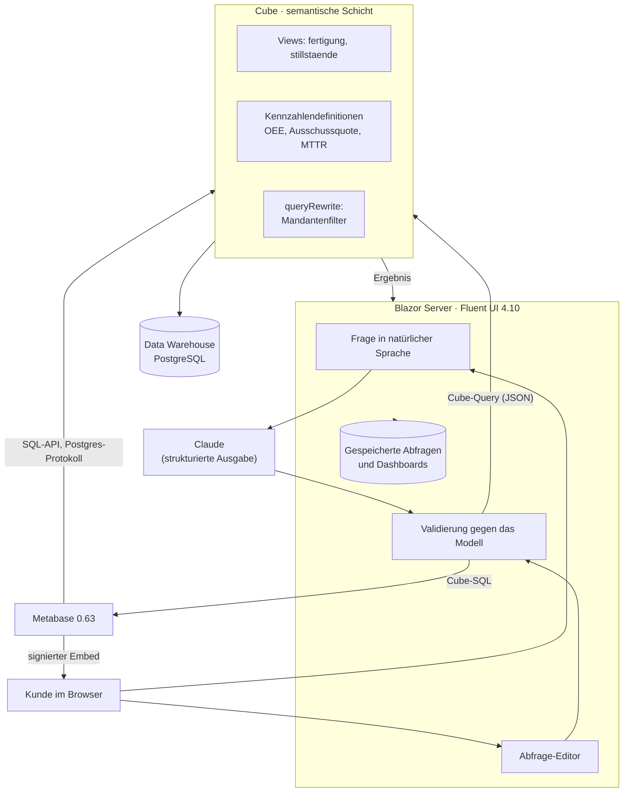

# NLTSQL — Self-Service-Datenabfrage mit semantischer Schicht

Prototyp einer Plattform, auf der Kunden ihre Datenbank selbst auswerten:
Frage stellen oder Abfrage zusammenklicken, Ergebnis als Tabelle und
Diagramm, Export als CSV, Ablage auf einem Dashboard und Übergabe an
Metabase zum Weiterfiltern.

Der Kern ist bewusst nicht die Oberfläche, sondern die **semantische
Schicht dazwischen**: Kennzahlen wie die OEE sind genau einmal definiert
— in Cube — und liefern in der Anwendung, im Diagramm, im CSV und in
Metabase denselben Wert.

---

## Architektur



Zwei Wege führen in die semantische Schicht, und **beide** enden dort —
keiner davon spricht direkt mit dem Warehouse:

* Die Anwendung fragt Cube über die **REST-API** ab und rendert Tabelle
  und CSV selbst.
* Metabase ist als Datenbank an Cubes **SQL-API** (Postgres-Protokoll)
  angebunden. Eine Frage, die an Metabase übergeben wird, liest deshalb
  dieselben Kennzahlendefinitionen. Wer dort weiterfiltert, bekommt
  weiterhin die OEE aus dem Modell — und nicht eine zweite, abweichende
  Definition in einer Metabase-Frage.

---

## Warum eine semantische Schicht

In einer fachspezifischen Domäne ist die eigentliche Schwierigkeit nicht
SQL, sondern die Fachlichkeit. „OEE“ ist Verfügbarkeit × Leistungsgrad ×
Qualitätsrate, und jeder dieser Faktoren hat eine bestimmte Bezugsgröße.
Wird das in Abfragen, Dashboards und Exporten jeweils neu formuliert,
driften die Zahlen auseinander — meistens unbemerkt.

Deshalb liegt die Fachlichkeit in `infra/cube/model/` und nirgends sonst:

* **Kennzahlen als Quotient zweier additiver Summen.** `scrap_rate` ist
  `Summe(Ausschuss) / Summe(Gesamtmenge)`, nicht der Mittelwert der
  Schichtquoten. Nur so stimmt die Zahl auf jeder Aggregationsebene, und
  nur so lässt sie sich aus einer Pre-Aggregation beantworten.
* **Views als einziger Vertrag.** Die zugrundeliegenden Cubes sind
  `public: false`. Physische Joins und Spalten können sich ändern, ohne
  eine gespeicherte Abfrage oder eine Metabase-Frage zu brechen.
* **Fachvokabular am Modell.** Jedes Feld trägt Titel, Beschreibung und
  Synonyme (`Anlageneffektivität`, `Ausschussrate`, `MTTR`). Daraus
  entsteht der Katalog für die Frageeingabe — wächst das Modell, wächst
  das Sprachverständnis mit, ohne Codeänderung.

---

## Sicherheit

| Thema | Umsetzung |
|---|---|
| Kein SQL aus der Oberfläche | Es gibt keine Methode, die SQL entgegennimmt. Alles ist eine `SemanticQuery` über katalogisierte Felder. |
| LLM-Ausgabe | Auf ein JSON-Schema beschränkt und anschließend gegen das *live* geladene Modell validiert. Unbekannte Felder werden abgelehnt, nicht ausgeführt. |
| Mandantentrennung | Der Server signiert pro Anfrage ein kurzlebiges JWT mit dem Security-Context. Cube hängt in `queryRewrite` den Filter an — *nach* dem Parsen, also nicht entfernbar. |
| Datenbankzugriff | Cube verbindet sich mit einer reinen Lese-Rolle (`cube_reader`). |
| Metabase-Vorschau | Static Embedding mit serverseitig signiertem Token. Der Browser hält keine Metabase-Session. |
| CSV-Download | Kurzlebiges, mandantengebundenes Ticket statt Abfrage in der URL. |

Der Prototyp hat **keine Benutzeranmeldung**: `ITenantContext` kommt aus
der Konfiguration. Das ist die eine Stelle, die für einen echten Betrieb
zu ersetzen ist — alles dahinter benutzt bereits diese Abstraktion.

---

## Voraussetzungen

* Docker und Docker Compose
* .NET SDK 9.0 (nur, wenn die App außerhalb von Compose laufen soll)
* Optional ein Anthropic-API-Key für die Frageeingabe

---

## Einrichtung

### 1. Konfiguration anlegen

```bash
cp .env.example .env
```

Danach in `.env` echte Werte setzen. Für die Secrets:

```bash
openssl rand -hex 32
```

Mindestens nötig: `POSTGRES_PASSWORD`, `CUBEJS_API_SECRET` (≥ 32
Zeichen), `CUBEJS_SQL_PASSWORD`, `METABASE_EMBEDDING_SECRET_KEY`.

### 2. Infrastruktur starten

```bash
docker compose up -d
```

Das startet das Demo-Warehouse (Schema und Daten werden beim ersten Start
eingespielt), Cube und Metabase. Metabase braucht beim ersten Start etwa
eine Minute.

### 3. Metabase verbinden

```bash
set -a && source .env && set +a
python3 infra/metabase/bootstrap.py
```

Das Skript legt den Admin-Benutzer an, erzeugt einen API-Key, schaltet
Static Embedding frei und registriert Cubes SQL-API als Datenbank. Am
Ende gibt es drei Werte aus, die in `.env` gehören:

```
METABASE_API_KEY=...
METABASE_EMBEDDING_SECRET_KEY=...
METABASE_CUBE_DATABASE_ID=...
```

`METABASE_EMBEDDING_SECRET_KEY` muss mit dem Wert übereinstimmen, den
Compose als `MB_EMBEDDING_SECRET_KEY` gesetzt hat — sonst weist Metabase
die signierten Embed-Tokens ab und die Vorschau bleibt leer.

Dieselben Schritte gehen auch von Hand über die Metabase-Oberfläche:
*Admin → Einstellungen → Authentifizierung → API-Schlüssel*,
*Admin → Einstellungen → Einbetten → Statisches Einbetten* und
*Admin → Datenbanken → Datenbank hinzufügen* (PostgreSQL, Host `cube`,
Port `15432`, Datenbank `cube`).

### 4. Anwendung starten

Aus der IDE oder per CLI:

```bash
dotnet run --project src/Nltsql.Web
```

Oder mitsamt Container:

```bash
docker compose --profile app up -d
```

Die App liegt dann auf <http://localhost:8080>, Metabase auf
<http://localhost:3000>, der Cube-Playground auf <http://localhost:4000>.

### 5. Frageeingabe aktivieren (optional)

`ANTHROPIC_API_KEY` in `.env` setzen (bzw. `Planner:ApiKey` per
User-Secrets). Ohne Key bleibt die Plattform vollständig benutzbar — nur
das Frage-Feld ist ausgeblendet, der Abfrage-Editor kann alles, was die
Frageeingabe auch erzeugen könnte.

---

## Was der Prototyp kann

* **Fragen stellen.** „OEE je Maschine in den letzten 30 Tagen“ wird in
  eine Abfrage übersetzt. Darüber steht immer, *wie* die Frage verstanden
  wurde, und darunter die tatsächlich erzeugte Abfrage — beides
  korrigierbar, bevor jemand der Zahl vertraut.
* **Abfragen bauen.** Datenbereich, Kennzahlen, Merkmale, Zeitraum,
  Filter, Sortierung, Zeilenlimit.
* **Ergebnis ansehen.** Tabelle mit fachlichen Titeln, Prozentwerten und
  deutscher Zahlenformatierung; Hinweis, wenn ein Limit gegriffen hat.
* **Diagramm.** Metabase erzeugt die Vorschau, eingebettet in der Seite.
  Der Diagrammtyp wird aus der Form der Abfrage vorgeschlagen.
* **In Metabase weiterarbeiten.** Frage öffnen oder direkt auf ein
  Metabase-Dashboard legen.
* **Speichern.** Gespeichert wird die *Abfrage*, nicht das Ergebnis. Beim
  Öffnen läuft sie erneut — ein Dashboard zeigt damit immer den aktuellen
  Stand unter den aktuellen Definitionen.
* **CSV-Export.** Voreingestellt so, wie Excel mit deutschen
  Regionaleinstellungen es ohne Importdialog liest: Semikolon,
  Dezimalkomma, UTF-8 mit BOM.

---

## Demo-Domäne

Serienfertigung und Instandhaltung. Das Warehouse ist ein kleines
Sternschema mit deterministisch erzeugten Daten über rund 18 Monate.

Zwei Datenbereiche:

* **`fertigung`** — Mengen, Zeiten und die OEE-Faktoren je Maschine,
  Produkt, Schicht und Werk.
* **`stillstaende`** — Stillstandsereignisse nach Störgrund, geplant und
  ungeplant, inklusive MTTR.

In den Daten steckt ein Befund: **CNC-Zentrum 2** hat in den letzten 120
Tagen eine deutlich erhöhte Ausschussquote (rund 8 % gegenüber sonst
2,7 %). Gute erste Frage: *„Ausschussquote je Maschine pro Monat im
letzten Jahr“*.

Zum Austausch gegen echte Kundendaten sind zwei Dinge zu ersetzen: das
Warehouse-Schema unter `infra/warehouse/` und das Modell unter
`infra/cube/model/`. Die Anwendung kennt keine Tabellennamen.

---

## Projektstruktur

```
infra/
  warehouse/       Schema und Demodaten des Warehouses
  cube/model/      Semantische Schicht: Cubes (privat) und Views (öffentlich)
  cube/cube.js     Mandantentrennung via queryRewrite
  metabase/        Einrichtungsskript
src/
  Nltsql.Core/             Domäne: Abfragevertrag, Validierung, SQL-Rendering
  Nltsql.Infrastructure/   Cube-, Metabase- und Planner-Anbindung, Persistenz, CSV
  Nltsql.Web/              Blazor Server mit Fluent UI
tests/
  Nltsql.Tests/            Tests für Validierung, SQL, Mapping und Export
```

`Nltsql.Core` hat bewusst **keine** Paketabhängigkeiten: Abfragevertrag,
Validierung und SQL-Erzeugung sind ohne Cube, Metabase, Datenbank oder
Sprachmodell testbar.

---

## Entwicklung

```bash
dotnet build          # Warnungen sind Fehler (Directory.Build.props)
dotnet test
```

Weitere Hinweise zu den Entwurfsentscheidungen: [`docs/entscheidungen.md`](docs/entscheidungen.md).

---

## Stand des Prototyps

Bewusst offen gelassen, weil es den Rahmen eines leichtgewichtigen
Prototyps sprengen würde:

* **Keine Authentifizierung.** Mandant und Datenbereich kommen aus der
  Konfiguration. Ersatzpunkt ist `ITenantContext`.
* **`EnsureCreated` statt Migrationen.** Für einen geteilten Betrieb auf
  `MigrateAsync` umstellen und eine erste Migration erzeugen.
* **SQLite als Anwendungsspeicher.** Trägt Prototyp-Last; für
  Mehrbenutzerbetrieb auf PostgreSQL wechseln (nur der Connection-String
  und das Provider-Paket).
* **Interne Dashboards zeigen Tabellen.** Die Diagrammansicht läuft über
  Metabase; interne Kacheln rendern das Ergebnis als Tabelle.
* **Pre-Aggregations sind definiert, aber nicht eingeplant.** Für große
  Datenmengen einen Refresh-Worker konfigurieren.

Ehrlichkeitshinweis zur Verifikation: .NET-Build und Tests laufen
nachweislich durch, das Warehouse-SQL wurde gegen ein echtes PostgreSQL
16 eingespielt und geprüft. Cube und Metabase konnten in der
Entwicklungsumgebung nicht gestartet werden (kein Netzzugriff auf die
Images), daher sind die Cube- und Metabase-Aufrufe anhand der
dokumentierten API implementiert und über Unit-Tests der
Datenabbildung abgesichert, aber nicht gegen laufende Instanzen erprobt.
Beim ersten Start beider Dienste ist mit kleineren Anpassungen zu rechnen.
